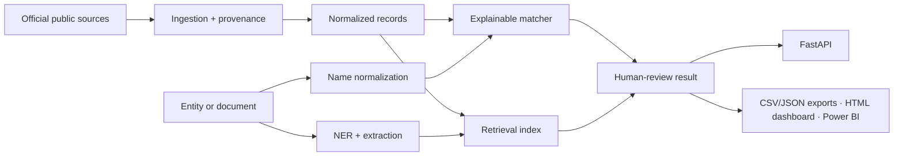

# Compliance Intelligence Platform

[](https://github.com/nick-bellows/compliance-intelligence-platform/actions/workflows/quality.yml)

An auditable portfolio system for public sanctions screening and information extraction over legal/government text. It combines entity normalization, explainable fuzzy matching, structured extraction, retrieval, API interoperability, evaluation, and analyst-ready exports.

> **Status: implemented reference system, validated with committed synthetic fixtures and public-source adapters.** The included names and example records are fictional. Reported evaluation results apply only to the versioned labeled sets in this repository; they are not real screening determinations.

**[Open the three-minute synthetic analyst walkthrough](https://nick-bellows.github.io/compliance-intelligence-platform/)** (GitHub Pages, no install) to follow a clear result, an explainable review candidate, and the API's fail-closed behavior. The page is the committed [docs/index.html](docs/index.html), generated from reviewed run tables and drift-checked in CI; it does not expose a public screening endpoint.

## Technology demonstrated

Python 3.12, FastAPI, Pydantic, RapidFuzz, spaCy, BM25, sentence-transformers, pytest, mypy, Ruff, Docker, GitHub Actions, versioned CSV/JSON analyst exports, and dependency-free HTML/SVG reporting.

## Intended users

- A diligence analyst screening a customer, partner, or supplier
- A reviewer investigating why an entity was flagged
- A research engineer evaluating extraction and retrieval behavior
- A downstream reporting workflow consuming structured results

## Core principles

1. A possible match is a review lead, not a compliance determination.
2. Every output links back to a source record and dataset snapshot.
3. The API fails closed when sanctions data is unavailable.
4. Matching thresholds are evaluated, versioned, and never silently changed.
5. Synthetic examples are visibly labeled and isolated from authoritative data.

## Architecture



## Repository map

```text
src/compliance_intelligence/  Application package
tests/                        Unit and contract tests
data/                         Source manifests, synthetic samples, and local data areas
eval/                         Labeled-set schemas and evaluation entry points
docs/                         Architecture, governance, evaluation, and threat model
powerbi/                      Dashboard schema and build instructions
scripts/                      Developer and data-quality commands
output/                       Ignored generated reports and exports
```

## Quick start

```powershell
python -m venv .venv
./.venv/Scripts/Activate.ps1
python -m pip install -e ".[dev]"
pytest
compliance-intelligence ingest --source synthetic
$env:ALLOW_SYNTHETIC_DATASET = "true"
uvicorn compliance_intelligence.api.main:app --reload
```

The health endpoint is available immediately. The screening endpoint returns `503` until a verified dataset snapshot is loaded; this prevents an empty dataset from producing false “clear” results. Snapshots are loaded at startup from `SNAPSHOT_DIRECTORY` (default `data/processed/snapshots`); snapshots produced from the synthetic fixture are excluded unless `ALLOW_SYNTHETIC_DATASET=true`, keeping demonstration data isolated from real screening.

The GitHub Actions workflow in `.github/workflows/quality.yml` runs lint, strict type checks, tests with a coverage gate, manifest validation, the walkthrough and evaluation-report drift checks, a container smoke test (`503` with no verified snapshot, then an exact hit with snapshot provenance from the synthetic fixture), a dependency vulnerability audit, and a full-history secret scan on every push. `scripts/run_checks.ps1` runs the same Python checks locally; `scripts/smoke_docker.ps1` or `scripts/smoke_docker.sh` runs the container test.

For the containerized API:

```powershell
Copy-Item .env.example .env
docker compose config
docker compose up --build
```

The API port is bound to `127.0.0.1`. The container loads snapshots from the read-only `./data` mount at startup; with `ALLOW_SYNTHETIC_DATASET=true` in `.env` it serves the labeled synthetic fixture. To screen against authoritative data instead, run `compliance-intelligence ingest --source ofac` and `compliance-intelligence ingest --source un` on the host (each saves a verified snapshot with source URL, retrieval time, terms note, and SHA-256 under `data/processed/snapshots` and marks the source active in the manifest), keep `ALLOW_SYNTHETIC_DATASET=false`, and restart the container. The API serves the newest snapshot per source (earlier files stay on disk for audit), and `/health` reports snapshot age, turning `degraded` past the configured maximum.

## Delivery milestones

### M1 — Screening MVP

- [x] Implement OFAC plus one secondary official-source adapter (OFAC SDN + UN Consolidated List).
- [x] Capture source URL, retrieval time, terms/license note, and SHA-256.
- [x] Normalize names, aliases, identifiers, countries, and programs.
- [x] Evaluate thresholds on a labeled name-pair set — see [eval/results/matching_report.md](eval/results/matching_report.md).
- [x] Expose `/v1/screen` and generate CSV/JSON review output (`screen`, `screen-batch`).

### M2 — NLP and retrieval

- [x] Select and document a license-clean legal/government corpus (Federal Register OFAC notices, public domain).
- [x] Implement entity extraction with spaCy plus domain rules (`extract`; rule/model attribution per span).
- [x] Define structured records and validation behavior (`CorpusDocument`, corpus jsonl store, manifest entry).
- [x] Implement BM25 retrieval and a labeled query set — plus dense (MiniLM) and hybrid (RRF) modes beyond the original plan.
- [x] Report NER precision/recall/F1 and retrieval Recall@k/MRR — see [eval/results/ner_report.md](eval/results/ner_report.md) and [eval/results/retrieval_report.md](eval/results/retrieval_report.md).

### M3 — Portfolio release

- [x] Docker build and smoke test pass (`scripts/smoke_docker.ps1`).
- [x] CI, lint, types, and tests pass — the [quality workflow](https://github.com/nick-bellows/compliance-intelligence-platform/actions/workflows/quality.yml) runs them on every push; `scripts/run_checks.ps1` runs the same commands locally.
- [x] Data cards and model/evaluation cards are complete ([docs/data-cards/](docs/data-cards/), [docs/model-cards/](docs/model-cards/)).
- [x] Dashboard ships in-repo: `compliance-intelligence dashboard --run-dir <run>` renders the five documented views (KPIs, review queue, score distribution with versioned thresholds, hits by source, dataset freshness) as one dependency-free HTML file — committed synthetic-only walkthrough at [docs/index.html](docs/index.html), published on [GitHub Pages](https://nick-bellows.github.io/compliance-intelligence-platform/), rendering and artifact drift tested. The Power BI import path remains documented in [powerbi/README.md](powerbi/README.md) for teams standardized on it.
- [x] Limitations, failure cases, and human-review workflow are documented ([docs/limitations.md](docs/limitations.md)).

## Disclaimer

This project is an educational screening aid. It does not provide legal advice, determine sanctions status, replace source-list review, or replace a qualified compliance professional.
